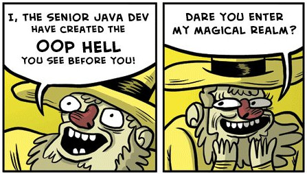

# CSSE374 Final Project

# Milestone 4
- Dependency Inversion

  If A has a B and B has an interface and B is concrete then there is a
  violation of the dependency inversion principle

- Decorators

  If you extend A and has an instance of A then you have
  decorated A

- Adapter

  if you extend a and have an instance of b and you override all of a's methods.
  and all of your methods use b

- Abstract Decorator

  If A is abstract and has an instance of the class it extends

Notes:
  String is a violation? Ignore string
  Implement code analysis

  If it extends abstract then it is a decorator

# Added
- make an analyzer remove certain relationships
- add hashmap to DOM
- getopt
- Add classes for association, dependency, bidirection
- Make sure arrows arent overwriting eachother
- Add cardinality setter
- Add cardinalities when we go from data structure to DOM
- fix the "if it fails it is primitive" problem

## Introduction

Our CSSE374 project is a UML generation tool meant to be **fully featured** and
**open to extension**. It was written using the Java ASM library and generates
Graphviz-compatible .DOT files to be compiled and viewed with an external editor. This
project was written by Wenkang Dang, Sabrina Wicker, and Coleman Gibson.

only association, not

## Using Our Project

### Installing the Graphviz
1. Download the Graphviz from http://graphviz.org/Download..php
2. Install the Graphviz.

### Customing the Setting File for Configuration
1. Create a folder named "input_output" in the root directory of your own java project.
2. Create a txt file named "setting.txt" as the setting file.
2. Write the objects related to the 10 keywords as the format below:

	include: 
	(setting the whitelist of classes.)
	disclude: 
	(setting the blacklist of classes.)
	synthdisplay: 
	analyzers: analyzers.DecoratorDetector analyzers.AssociationSupercedesDependencyAnalyzer 				analyzers.IsACollectionAndAddCardinalityAnalyzer analyzers.MergeArrowAnalyzer 				analyzers.SingletonDetector analyzers.ViolatesCompositionOverInheritanceAnalyzer 				analyzers.DependencyInversionAnalyzer
	(setting the list of analyzers need to be run, usually it doesn't need to be change.)
	access: 
	(Write "private", "public", or "protected" to limit the fields and methods displayed.)
	recursive: 
	(setting if the program need to recursively parse all the superclasses and interfaces in java. Write "on" or "off")
	fontColor: Eg. black
	(setting the font color in the diagram.)
	graphColor: Eg. white
	(setting the color of frame of each class in the diagram.)
	graphBGColor: Eg. black
	(setting the background color in the diagram created. )
	fontSize: Eg. 12 
	(setting the font size in the diagram.)
	
3. Save the file.

### Running the project
1. Put the csse374-project.jar in the root directory of your own java project.
2. Run the jar from the command line
	java -jar csse374-project.jar

### Openning the diagram
1. Launch the Graphviz you install before.
2. Open the "out.dot" file in the "input_output" folder you create before.

## Contributions

### Wenkang
- Update the uml design for our milestone 1 at end
- Do some start for command line arguments
- various analyzers

### Sabrina
- Contributed to overall design and many design refinement debates
- Edge implementation
- (lots and lots of) DOT code debugging. DOT queen.
- Code design improvements via abstraction of related classes
- Interface cleanup
- various analyzers

### Coleman
- Contributed to design
- Helped to write the class -> graph parsing code
- Helped to write the graph -> DOM parsing code
- various analyzers
